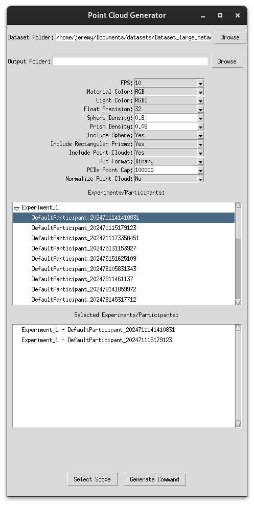

# MazeLab Toolset

Welcome to the **MazeLab Toolset**! This documentation provides an overview of how to convert the MazeLab dataset metadata into a point cloud video.

### Dataset Access
The dataset can be accessed through the following link: **[\[Here\]](https://1drv.ms/f/c/083b7c8a62b5d789/ErfWl1NBAZVHg6T_hDBkkZkBys-5xauOZjRRd8CUEE7BSg?e=85Gd6z)**.

## Installation

Before using the MazeLab Toolset, ensure you have all required dependencies installed. Run the following command to install them:

```bash
pip install -r requirements.txt
```

For best compatibility, it is highly recommended to use a fresh virtual environment like conda. 

## Overview
This repository contains two main utilities:
1. **Command Generator** – A GUI tool that simplifies the creation of conversion commands.
2. **Metadata to Point Cloud Converter** – A tool that processes the dataset and generates a structured point cloud representation.

Since specifying experiment-participant pairs and conversion settings manually can be tedious, the **Command Generator** provides an interactive way to generate the required command automatically. The **Converter** then processes the dataset and outputs point clouds in the same structural format as the pre-converted dataset.

The sections below explain how to use these tools.


## Command Generation

### GUI Overview


The **Command Generator** requires the link to the metadata dataset folder. Once entered, the first window will populate with a list of all available experiments. Selecting an experiment will display a dropdown list of participants.

### Selecting Experiments and Participants
- To convert an entire experiment (all participants included), click on the experiment name and press the **Select Scope** button at the bottom.
- To select specific participants, expand the experiment and choose individual participants.
- For multiple selections:
  - Hold **Ctrl** and click on each desired item.
  - Hold **Shift** to select a range.

### Adjusting Conversion Settings
Above the selection window, you can modify the default conversion settings:
- **FPS** – Defines how many point clouds will be generated per second from the metadata.
- **Material Color** – Specifies the material color used in the point cloud.
- **Light Color** – Represents the color of the closest light source.
- **Float Precision** – Determines the precision of floating-point values. **16-bit is available** but not standard for PLY files, meaning most PLY-reading libraries may not support it.
- **Density Options** – It is recommended to start with default settings on a small subset before adjusting density levels.
- **Object Exclusion** – Exclude specific object types (e.g., rectangular prisms, spheres, or point clouds inside the maze) by setting the respective option to "No".
- **PLY Format** – Choose **ASCII** for human-readable files or **Binary** for storage efficiency.
- **Point Cap** – Random downsampling ensures the total number of points per frame stays below a given threshold.
- **Normalization** – This option is for development purposes and should remain "No". Apply normalization post-generation if needed.

### Generating the Command
Once selections and settings are finalized, press the **Generate Command** button. The command will be copied to your clipboard, ready for execution in a terminal.

#### Launching the GUI
Run the following command from the main repository folder:
```bash
python commandGenerator.py
```

## Point Cloud Generation

Once you have generated the command, execute it in a terminal that has access to `main.py`.

### Running in the Background
Since conversion can be time-consuming (depending on storage speed and settings), it is recommended to run it in the background using `nohup`. For an example of how to run the generated command, refer to `script.sh`.

### Dataset Size Considerations
- The final dataset can be **hundreds of GBs** in size.
- High-density representations with all point features can exceed **petabytes**.
- For the final representation with static elements concatenated across frames, expect much larger sizes.
- To manage storage efficiently, it is recommended to concatenate only required frames at runtime or process a small subset of the dataset.


## Using the Generated Point Cloud Dataset

Once generated, your dataset folder will contain all recorded experiments, structured as follows:
```
Dataset/
  ├── Experiment_1/
  │    ├── Participant_A/
  │    │    ├── DynamicActors/
  │    │    │    ├── frame_N.ply
  │    ├── StaticPCDs/
```
### Generating a Point Cloud Video
1. **Load the Dynamic Actors**
   - Navigate to the `DynamicActors` folder within a participant’s directory.
   - Select a frame (`frame_N.ply`), which contains all dynamic elements for that moment.
   - Load the file using your preferred library.

2. **Load the Static Elements**
   - Navigate to the `StaticPCDs` folder in the experiment directory.
   - Load all `.ply` files corresponding to static elements.

3. **Combine Data**
   - Merge the dynamic frame with the static elements to reconstruct the full point cloud for that frame.
   - Repeat this process for every frame to generate a full sequence.

By following these steps, you can obtain a complete **point cloud video** representation of the MazeLab dataset.

---

For any issues or questions, feel free to reach out!

